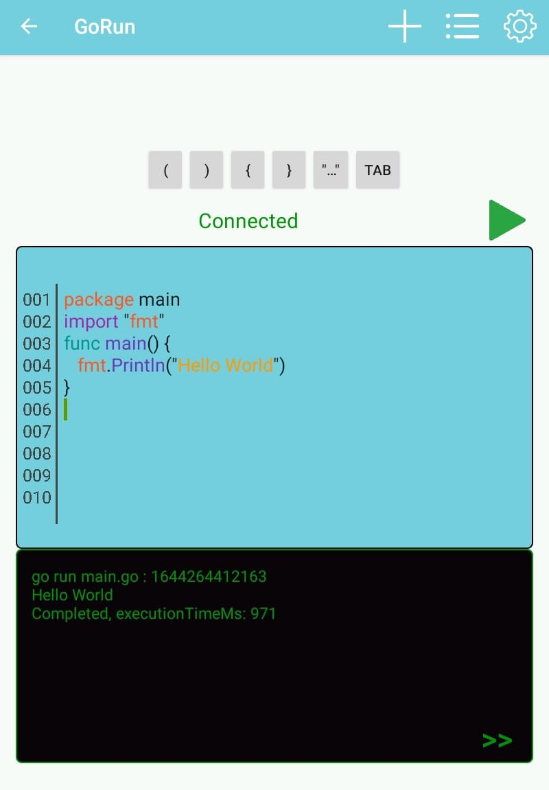
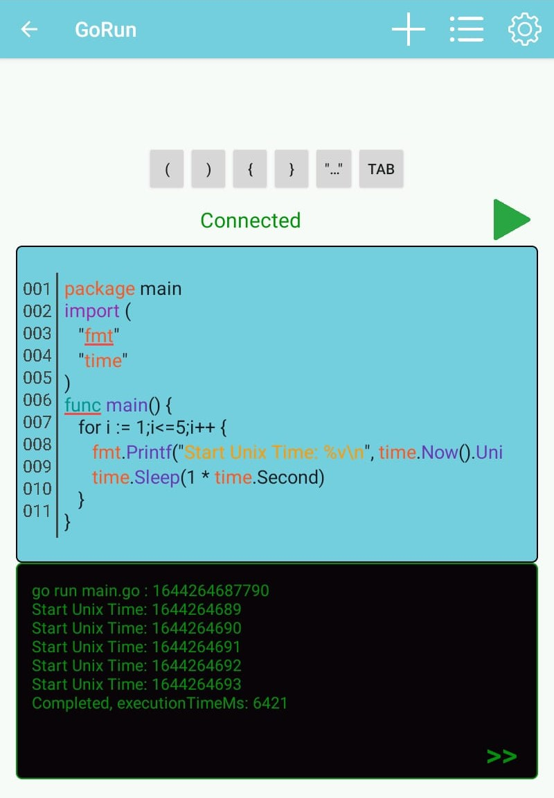
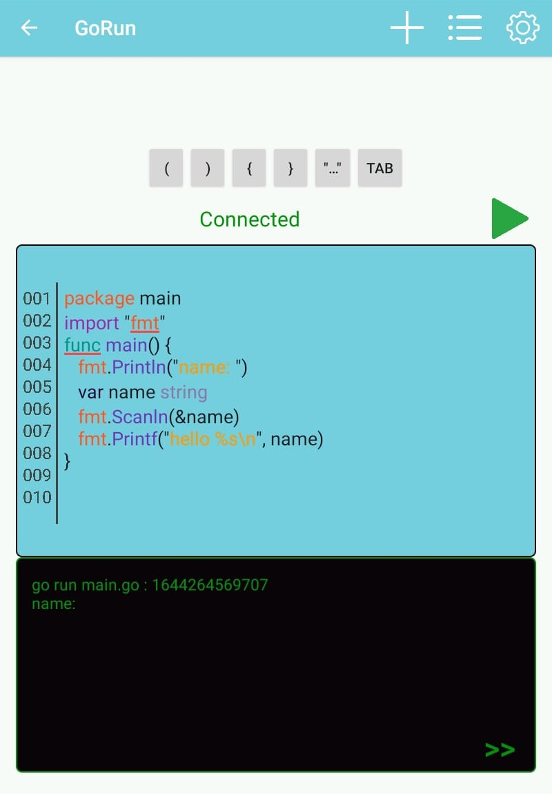
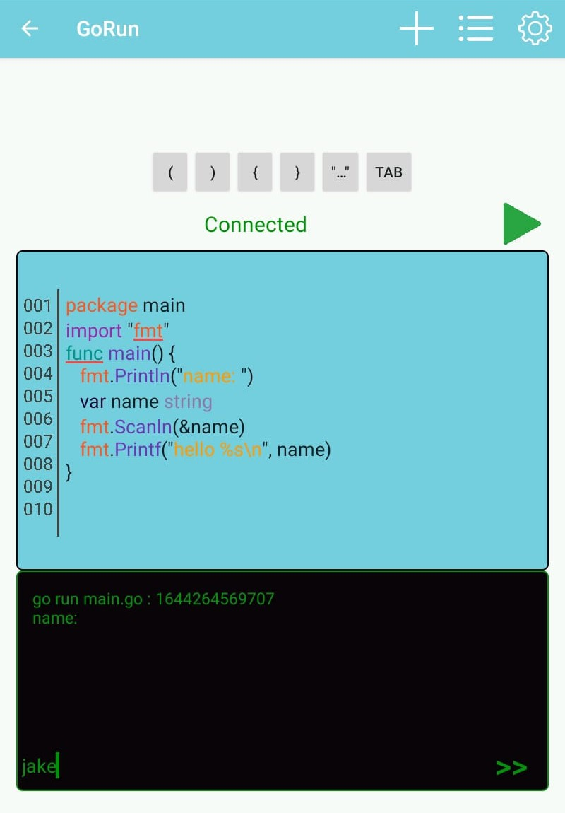
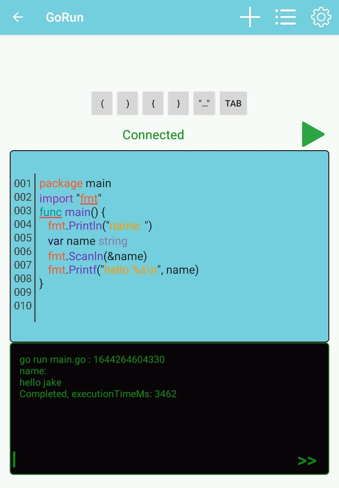

# GoRun

GoRun is a server application let you execute your go code through a web socket connection.

gorun-android is android app that creates interactive console between your android device and gorun server in order to execute go codes in Android platform.

### Techs

Tech stack used in this project

- Java17
- Spring Boot
- Reactor
- Netty
- MySQL
- Maven
- Docker

### In App Images

    
    
     
    
    
    

